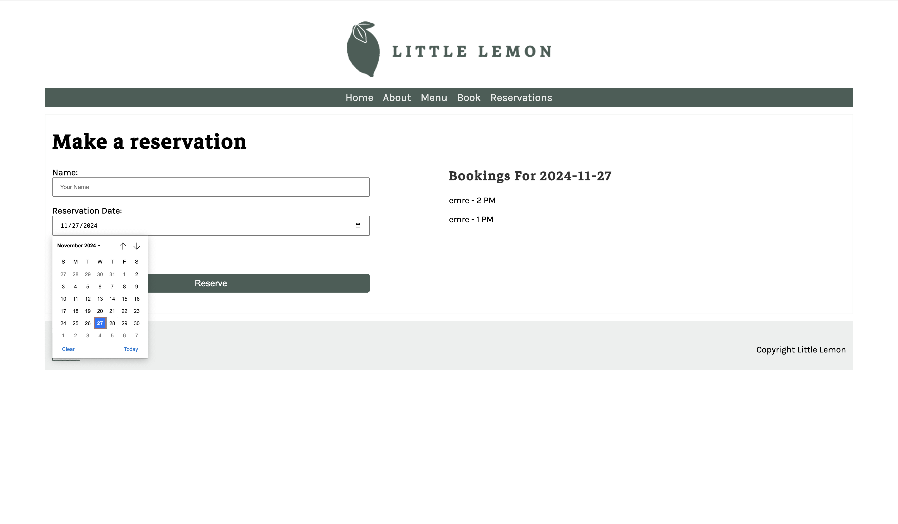
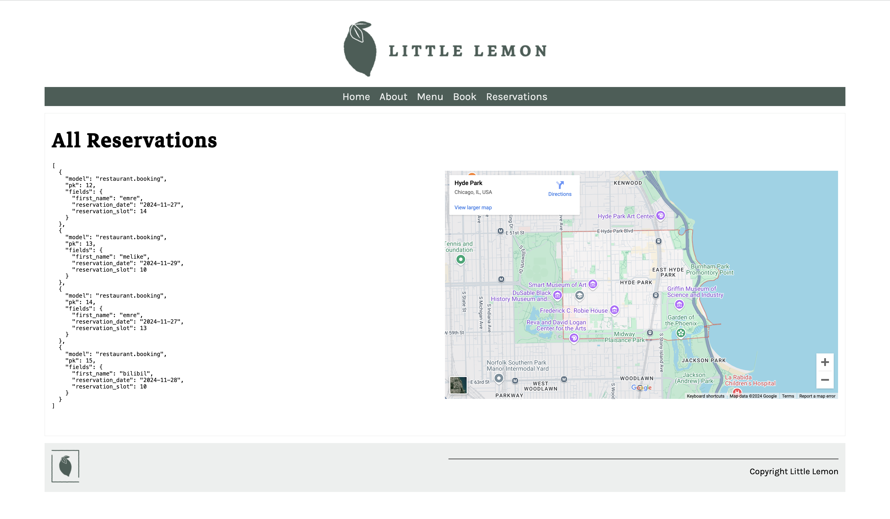

# Little Lemon Booking System

This project is the back-end implementation for the booking form on the Little Lemon website, completed as part of a Coursera course. It is a full-stack application using Django for the back-end, MySQL for the database, and JavaScript for handling form components.

## Features
- Booking form with fields for:
  - First Name
  - Reservation Date
  - Reservation Slot
- Date selector integrated into the reservation date field.
- Duplicate bookings are prohibited for the same date and time.
- All bookings are displayed as JSON data on the reservations page.
- Fetch API used to retrieve booking data.
- Bookings can be queried for a specific date via the API.
- Displays "No Booking" message if no reservations exist for a selected date.
- Automatically selects the current date when the form loads.

## Technologies Used
- **Django**: Back-end framework.
- **MySQL**: Database management.
- **JavaScript**: For dynamic form handling.
- **HTML/CSS**: Front-end provided as starter code.

## Setup Instructions

1.**Clone the repository**  
   Run the following commands to clone the repository and navigate to the project directory:
   ```bash
   git clone https://github.com/your-username/repository-name.git
   cd repository-name
  ```
2. **Set up the virtual environment**
  Use pipenv to create and activate the virtual environment, then install dependencies:
  ```bash
  pipenv shell
  pipenv install
  ```
3. **Configure the MySQL database**
  Update the DATABASES section in the settings.py file:
  ```python
  DATABASES = {
    'default': {
        'ENGINE': 'django.db.backends.mysql',
        'NAME': 'your_database_name',
        'USER': 'your_username',
        'PASSWORD': 'your_password',
        'HOST': 'localhost',
        'PORT': '3306',
    }
  }
  ```
4. Run migrations
  Apply migrations to set up the database schema:
  ```bash
  python manage.py makemigrations
  python manage.py migrate
  ```
5. Start the server
  Launch the Django development server:
  ```bash
  python manage.py runserver
  ```

## API Endpoints
Retrieve all reservations 
  _URL: /reservations/_

Retrieve reservations for a specific date
  _URL: /bookings?date=YYYY-MM-DD_

### Home Page


### Booking Form


### Reservations Page



  
